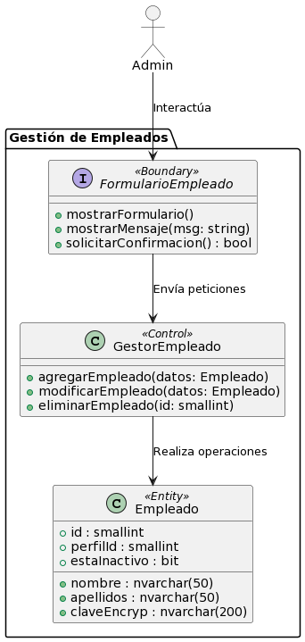

# Gestión de Empleados

 **Caso de Uso No. 1**

## Narrativa

El equipo administrativo del restaurante necesita un sistema para poder mantener actualizada la información sobre sus empleados. Con esto en mente, el sistema debería permitir al administrador agregar, modificar, eliminar o consultar información detallada de los empleados de la sucursal del restaurante.

## Casos de uso

Título del caso de uso: **GESTIÓN DE EMPLEADOS**

## Diagrama

## Definición

**Actores:**  Admin

**Descripción:** Permite al Admin del restaurante realizar la gestión completa de los datos de los empleados, que incluye agregar nuevos empleados, modificar información de empleados existentes, eliminar empleados y consultar la lista e información detallada de los empleados.

**Precondiciones:** Haber ingresado al sistema con la cuenta de Admin. Ubicarse en Menu Principal/Empleados.

**Pos condiciones:** Datos de algún empleado modificados o un empleado agregado/eliminado.

**Versión:** 0.0.1

**Fecha de creación:** [Fecha actual]

**Fecha de actualización:** [Fecha actual + cambios]

## Flujos

### Flujo Básico: Agregar Empleado

| ID | Actor | ID | Sistema | Excepción o Error |
|---|:---:|---|:---:|:---:|
| 1 | En "Empleados", selecciona la opción de agregar empleado. | 2 | Muestra el formulario para agregar una nueva empleado. |  |
| 3 | Ingresa la información de la nueva empleado y presiona "Guardar". | 4 | Valida la información y añade la empleado al menú. | R1 R2 E1 |
|  | | 5 | Muestra mensaje de "Empleado añadida con éxito". |  |

### Flujo Básico: Modificar Empleado

| ID | Actor | ID | Sistema | Excepción o Error |
|---|:---:|---|:---:|:---:|
| 1 | En "Empleados", selecciona una empleado. | 2 | Muestra los datos de la empleado en el formulario. |  |
| 3 | Modifica los datos de la empleado y presiona "Guardar". | 4 | Valida la información y modifica la empleado al menú. | R1 R2 E1 |
|  | | 5 | Muestra mensaje de "Empleado modificada con éxito". |  |

### Flujo Básico: Eliminar Empleado

| ID | Actor | ID | Sistema | Excepción o Error |
|---|:---:|---|:---:|:---:|
| 1 | En "Empleados", selecciona la empleado que desea eliminar.  | 2 | Muestra los datos de la empleado en el formulario. |  |
| 3 | Presiona "Eliminar". | 4 | Solicita confirmación para eliminar. |  |
| 5 | Confirma eliminación. | 6 | Elimina(soft delete) la empleado seleccionada de la base de datos. | E1 |
| | | 7 | Muestra mensaje de "Empleado eliminada con éxito". |  |

## Errores

| ID | Nombre | Respuesta del sistema |
|---|---|---|
| R1 | Campos vacíos | Si no se completan todos los campos requeridos, se muestra un mensaje indicando que es necesario llenarlos. |
| R2 | Datos inválidos | Si se ingresan datos que no corresponden al tipo esperado (por ejemplo, letras en un campo numérico), se mostrará un mensaje de error. |

## Excepciones

| ID | Nombre | Respuesta del sistema |
|---|---|---|
| E1 | Sin conexión a la base de datos | Si no hay conexión con la base de datos, se muestra un mensaje de error y se impide realizar la operación. |

## Requerimientos especiales

* Conexión a la base de datos.

## Observaciones

N/A

## Entidades

### B_Empleado

| Columna       | Tipo de dato | Descripción           |
|---------------|--------------|-----------------------|
| id            | smallint     | Clave primaria        |
| nombre        | nvarchar(50) | Nombre de empleado    |
| apellidos     | nvarchar(50) | Apellidos de empleado |
| claveEncryp   | nvarchar(200)| Clave encriptada      |
| perfilId      | smallint     | Clave foránea a B_Perfil.id |
| estaInactivo  | bit          | Estado de inactividad |

## Diagrama EBC

