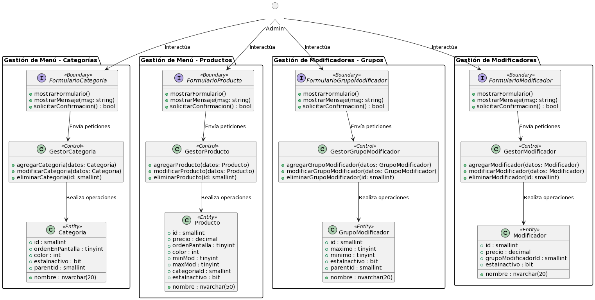

# Gestión De Menú

**Caso de Uso No. 4**

## Narrativa

Para mantener la oferta culinaria del restaurante actualizada y asegurarse de que los clientes tengan acceso a las categorías, subcategorías, productos y modificadores más recientes, el equipo administrativo requiere un sistema que les permita actualizar el menú del establecimiento.

## Casos de uso

Título del caso de uso: **GESTIÓN DE MENÚ**

## Diagrama:

## Definición

**Actores:** Admin

**Descripción:** El Admin tiene la capacidad de modificar el menú del restaurante, que incluye la gestión de categorías, subcategorías, productos y modificadores.

**Precondiciones:** Haber ingresado al sistema con la cuenta de Admin. Ubicarse en Menu Principal/Menú. 

**Pos condiciones:** Cambios realizados en el menú según las acciones del Admin.

**Versión:** 0.0.2

**Fecha de creación:** [Fecha actual]

**Fecha de actualización:** [Fecha actual + cambios]

## Flujos

### Flujo Básico: Agregar Categoría

| ID | Actor | ID | Sistema | Excepción o Error |
|---|:---:|---|:---:|:---:|
| 1 | En "Categorías", selecciona la opción de agregar categoría. | 2 | Muestra el formulario para agregar una nueva categoría. |  |
| 3 | Ingresa la información de la nueva categoría y presiona "Guardar". | 4 | Valida la información y añade la categoría al menú. | R1 R2 E1 |
|  | | 5 | Muestra mensaje de "Categoría añadida con éxito". |  |

### Flujo Básico: Modificar Categoría

| ID | Actor | ID | Sistema | Excepción o Error |
|---|:---:|---|:---:|:---:|
| 1 | En "Categorías", selecciona una categoría. | 2 | Muestra los datos de la categoría en el formulario. |  |
| 3 | Modifica los datos de la categoría y presiona "Guardar". | 4 | Valida la información y modifica la categoría al menú. | R1 R2 E1 |
|  | | 5 | Muestra mensaje de "Categoría modificada con éxito". |  |

### Flujo Básico: Eliminar Categoría

| ID | Actor | ID | Sistema | Excepción o Error |
|---|:---:|---|:---:|:---:|
| 1 | En "Categorías", selecciona la categoría que desea eliminar.  | 2 | Muestra los datos de la categoría en el formulario. |  |
| 3 | Presiona "Eliminar". | 4 | Solicita confirmación para eliminar. |  |
| 5 | Confirma eliminación. | 6 | Elimina(soft delete) la categoría seleccionada de la base de datos. | E1 |
| | | 7 | Muestra mensaje de "Categoría eliminada con éxito". |  |

### Flujo Básico: Agregar Producto

| ID | Actor | ID | Sistema | Excepción o Error |
|---|:---:|---|:---:|:---:|
| 1 | En la sección "Productos", selecciona la opción de agregar producto. | 2 | Muestra el formulario para agregar un nuevo producto. |  |
| 3 | Ingresa la información del nuevo producto y presiona "Guardar". | 4 | Valida la información y añade el producto al catálogo. | R1 R2 E1 |
|  | | 5 | Muestra mensaje de "Producto añadido con éxito". |  |

### Flujo Básico: Modificar Producto

| ID | Actor | ID | Sistema | Excepción o Error |
|---|:---:|---|:---:|:---:|
| 1 | En la sección "Productos", selecciona un producto para modificar. | 2 | Muestra los datos del producto en el formulario. |  |
| 3 | Modifica los datos del producto y presiona "Guardar". | 4 | Valida la información y actualiza los datos del producto en el catálogo. | R1 R2 E1 |
|  | | 5 | Muestra mensaje de "Producto modificado con éxito". |  |

### Flujo Básico: Eliminar Producto

| ID | Actor | ID | Sistema | Excepción o Error |
|---|:---:|---|:---:|:---:|
| 1 | En la sección "Productos", elige el producto que deseas eliminar. | 2 | Muestra los detalles del producto en el formulario. |  |
| 3 | Presiona "Eliminar". | 4 | Solicita confirmación para eliminar el producto. |  |
| 5 | Confirma la eliminación. | 6 | Realiza la eliminación (soft delete) del producto en la base de datos. | E1 |
| | | 7 | Muestra mensaje de "Producto eliminado con éxito". |  |

### Flujo Básico: Agregar Grupo de Modificadores

| ID | Actor | ID | Sistema | Excepción o Error |
|---|:---:|---|:---:|:---:|
| 1 | En la sección "Grupos de Modificadores", elige la opción para agregar un nuevo grupo de modificadores. | 2 | Muestra el formulario para crear un nuevo grupo. |  |
| 3 | Ingresa los detalles del nuevo grupo de modificadores y presiona "Guardar". | 4 | Valida la información y agrega el grupo al menú de modificadores. | R1 R2 E1 |
|  | | 5 | Muestra mensaje de "Grupo de Modificadores añadido con éxito". |  |

### Flujo Básico: Modificar Grupo de Modificadores

| ID | Actor | ID | Sistema | Excepción o Error |
|---|:---:|---|:---:|:---:|
| 1 | En la sección "Grupos de Modificadores", selecciona un grupo que deseas modificar. | 2 | Muestra los datos del grupo en el formulario de edición. |  |
| 3 | Realiza las modificaciones necesarias en el grupo de modificadores y presiona "Guardar". | 4 | Valida la información y actualiza el grupo en el menú de modificadores. | R1 R2 E1 |
|  | | 5 | Muestra mensaje de "Grupo de Modificadores modificado con éxito". |  |

### Flujo Básico: Eliminar Grupo de Modificadores

| ID | Actor | ID | Sistema | Excepción o Error |
|---|:---:|---|:---:|:---:|
| 1 | En la sección "Grupos de Modificadores", elige el grupo de modificadores que deseas eliminar. | 2 | Muestra los detalles del grupo en el formulario. |  |
| 3 | Presiona "Eliminar". | 4 | Solicita confirmación para eliminar el grupo de modificadores. |  |
| 5 | Confirma la eliminación. | 6 | Realiza la eliminación (soft delete) del grupo de modificadores en la base de datos. | E1 |
| | | 7 | Muestra mensaje de "Grupo de Modificadores eliminado con éxito". |  |

### Flujo Básico: Agregar Modificador

| ID | Actor | ID | Sistema | Excepción o Error |
|---|:---:|---|:---:|:---:|
| 1 | En la sección "Modificadores", selecciona la opción para agregar un nuevo modificador. | 2 | Muestra el formulario de creación de modificador. |  |
| 3 | Ingresa los detalles del nuevo modificador y presiona "Guardar". | 4 | Valida la información y añade el modificador a la lista. | R1 R2 E1 |
|  | | 5 | Muestra mensaje de "Modificador añadido con éxito". |  |

### Flujo Básico: Modificar Modificador

| ID | Actor | ID | Sistema | Excepción o Error |
|---|:---:|---|:---:|:---:|
| 1 | En la sección "Modificadores", elige un modificador que deseas modificar. | 2 | Muestra los detalles del modificador en el formulario de edición. |  |
| 3 | Realiza las modificaciones necesarias en el modificador y presiona "Guardar". | 4 | Valida la información y actualiza el modificador en la lista. | R1 R2 E1 |
|  | | 5 | Muestra mensaje de "Modificador modificado con éxito". |  |

### Flujo Básico: Eliminar Modificador

| ID | Actor | ID | Sistema | Excepción o Error |
|---|:---:|---|:---:|:---:|
| 1 | En la sección "Modificadores", elige el modificador que deseas eliminar. | 2 | Muestra los detalles del modificador en el formulario. |  |
| 3 | Presiona "Eliminar". | 4 | Solicita confirmación para eliminar el modificador. |  |
| 5 | Confirma la eliminación. | 6 | Realiza la eliminación (soft delete) del modificador en la base de datos. | E1 |
| | | 7 | Muestra mensaje de "Modificador eliminado con éxito". |  |

## Errores

| ID | Nombre | Respuesta del sistema |
|---|---|---|
| R1 | Campos vacíos | Si no se completan todos los campos requeridos, se muestra un mensaje indicando que es necesario llenarlos. |
| R2 | Datos inválidos | Si se ingresan datos que no corresponden al tipo esperado, se mostrará un mensaje de error. |

## Excepciones

| ID | Nombre | Respuesta del sistema |
|---|---|---|
| E1 | Sin conexión a la base de datos | Si no hay conexión con la base de datos, se muestra un mensaje de error y se impide realizar la operación. |

## Requerimientos especiales

* Conexión a la base de datos.

## Entidades

### B_Categoria

| Columna         | Tipo de dato | Descripción         |
|-----------------|--------------|---------------------|
| id              | smallint     | Clave primaria      |
| nombre          | nvarchar(20) | Nombre de categoría |
| ordenEnPantalla | tinyint      | Orden en pantalla   |
| color           | int          | Color               |
| estaInactivo    | bit          | Estado de inactividad |
| parentId        | smallint     | Clave foránea a B_Categoria.id |

### B_GrupoModificador

| Columna       | Tipo de dato | Descripción           |
|---------------|--------------|-----------------------|
| id            | smallint     | Clave primaria        |
| nombre        | nvarchar(20) | Nombre de grupo de modificadores |
| maximo        | tinyint      | Máximo de modificadores |
| minimo        | tinyint      | Mínimo de modificadores |
| estaInactivo  | bit          | Estado de inactividad |
| parentId        | smallint     | Clave foránea a B_GrupoModificador.id |

### B_Modificador

| Columna       | Tipo de dato | Descripción           |
|---------------|--------------|-----------------------|
| id            | smallint     | Clave primaria        |
| nombre        | nvarchar(20) | Nombre de modificador |
| precio        | decimal      | Precio                |
| grupoModificadorId | smallint | Clave foránea a B_GrupoModificador.id |
| estaInactivo  | bit          | Estado de inactividad |

### B_Producto

| Columna       | Tipo de dato | Descripción           |
|---------------|--------------|-----------------------|
| id            | smallint     | Clave primaria        |
| nombre        | nvarchar(50) | Nombre de producto    |
| precio        | decimal      | Precio                |
| ordenPantalla | tinyint      | Orden en pantalla     |
| color         | int          | Color                 |
| minMod        | tinyint      | Mínimo de modificadores |
| maxMod        | tinyint      | Máximo de modificadores |
| categoriaId   | smallint     | Clave foránea a B_Categoria.id |
| subcategoriaId | smallint    | Clave foránea a B_SubCategoria.id |
| estaInactivo  | bit          | Estado de inactividad |

## Observaciones

N/A

## Diagrama EBC

